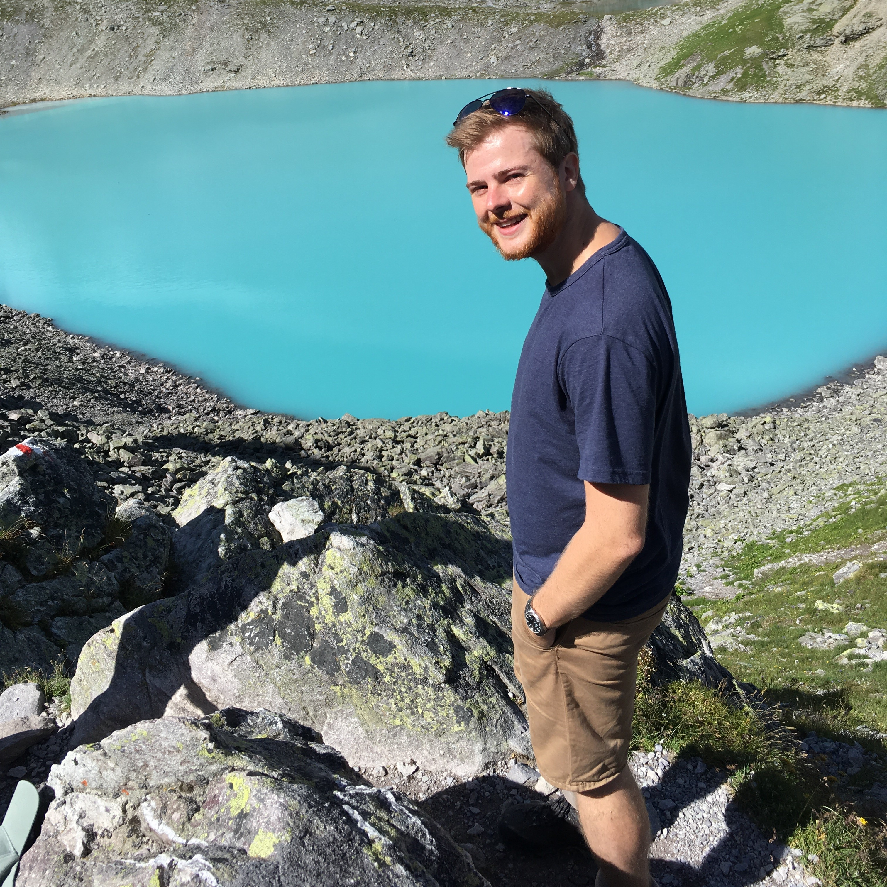

 

  

   
   <input type="checkbox" id="toggle1" class="unfolder" />
   <label for="toggle1" class="toggle-label">
   &#9654;
   &#9660;   Dominic</label>
   

   

   Hello there, I'm Dominic  
   Some information about my person:
   <ul>
    <li>I have around 120 books on my bookshelf, all of which I have read</li>
    <li>There's a didgeridoo next to my E-piano, guitar, saxophone, and ukulele</li>
    <li>I drink my coffee without milk or sugar</li>
    <li>I still don't quite understand how I can learn programming languages easily when looking at my French grades</li>
   </ul>
   <blockquote style="font-size:1em">
   <i>All musicians are subconsciously mathematicians</i> 
   - Thelonious Monk, Jazz musician
   </blockquote>
   

   

  

  

   
   <input type="checkbox" id="toggle2" class="unfolder" />
   <label for="toggle2" class="toggle-label">
   &#9654;
   &#9660;   Dr. Bräm</label>
   

   

   Hi, I'm Dr. Bräm 
   I'm an interdisciplinary scientist in the fields of pharmacometrics and machine learning. Already during my studies in pharmaceutical sciences at ETH Zürich, I was strongly interested in pharmacometrics, programming, and machine learning. After my graduation, I pursued these interests during an internship in the pharmacometrics department at Roche and then further during my PhD. I successfully defended my PhD thesis with the title <i> Novel Integration of Machine Learning and Pharmacometric Approaches to Facilitate Data Analyses in Clinical Research and Drug Development </i> in 2024 at the University Childrens Hospital Basel. My interdisciplinary expertise, my analytical way of thinking, my collaborative mindset, and my enthusiasm to learn new things make me a scientist that is able to solve (almost) any problem he is confronted with.
   <blockquote style="font-size:1em">
   <i>Dass ich erkenne was die Welt, im Innersten zusammen hält (GER)  
   So that I may perceive whatever holds the world together in its inmost folds (ENG) </i>
   - Johann Wolfang von Goether, Faust Part I
   </blockquote>
   

   

  

  

   
   <input type="checkbox" id="toggle3" class="unfolder" />
   <label for="toggle3" class="toggle-label">
   &#9654;
   &#9660;   Ringo</label>
   

   

   Hi, I'm Ringo 
   Being a scout is such a big part of me that it gets its own section here. Joining the scouts when I was 6 years old, I can't imagine how my life would look like without being Ringo (yes, in Switzerland every scout gets a special scout name). As a scout, I learned taking care of the nature and other people. During my time as scout leader and later group and section leader of our scout association, I learned taking responsibilities, organize and lead people. One major lesson that I internalised from my scout experiences is that to achieve success we need to advance as a team by recognizing and fostering the strengths of each person independent of their age, experience, or background.
   <blockquote style="font-size:1em">
   <i>Try and leave this world a little bettern than you found it </i>
   - Robert Baden-Powell, founder of scouts
   </blockquote>
   

   

  

 

